<style>
.red{
color: goldenrod;
}
code{
font-size: 1.5rem;
}
pre code{
font-size: 1.5rem;
}
li{
font-size: 1.5rem;
}
h1{
color: indianred;
}
h1:hover{
color:goldenrod;
}
h2{
color:seagreen;
}
p{
font-size: 1.8rem;
}
td{
font-size: 1.4rem;;
}
th{
font-size: 1.4rem;;
}
</style>


# OSI and TCP/IP models.
every protocol has its own header.
OSI - __Open System Interconnect Model__ divide the network into 7 layer.
The layers are:
- **application** 
- **presentation**
- **session** 
- **transport**
- **network**
- **data link**
- **physical**
## TCP/IP model
it has 4 layers. This is the model that is actually implemented in the internet.
# Layers of OSI Model.

## physical.
`this is a  code block`
```python
def hello():
    print("Hello World!")
```
physical layer is simply the physical media. It might be wireless media or wired media like fiber optic or copper wire. It uses the 0 and 1 binary digits to send the data.

## data link layer
data link layer uses physical medium to do the communication. Data link layer is mainly used for one to one connections. example of office network.

## 
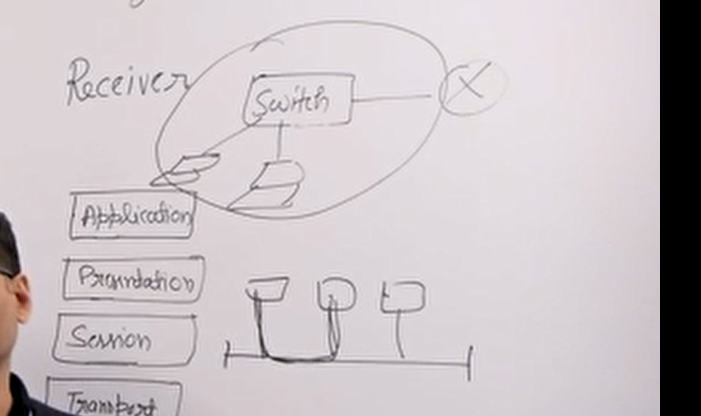

different devices connected to a switch and then connected to a router. So, the communication that happens between your local area network is done by the data link layer. The data link layer is responsible for communication between your local area network using a device called switch. Switch only processes the data link layer headers. 
switch, lan, wireless wi-fi.
shared medium like ethernet.
collision handling. 

## Network layer
Network layer devices are routers. All the routing happens using network layer. Network layer is implemented by IP protocol. IP protocol is part of TCP/IP model, which is a practical model. OSI is more of a theoretical model. IP protocol in the TCP/IP model is connectionless protocol. it is not reliable. 

## Transport layer
transport layer does end to end deliveries. Many processes are running at a time in computers. Transport layer provides 5 services. flow control, error control, connection services, connection release. 0 - 4 where 4 provides all the services. Internet actually implements TCP/IP model. The internet layer of the transport implements TCP and UDP 2 protocol. TCP has all the functionalities flow control, error control, and connection oriented etc. UDP provides the minimum form of implementation of transport layer.

## Session layer
Not implemented in the internet. Session layer does session management and authentication in the OSI model. These things in TCP/IP are implemented in the application layer. one more thing it does is combining of multiple streams. i.e. video, and webpage.

## Presentation layer
Not part of TCP/IP. Data compression on the sender side and data decompression on the receiver side. It also does encoding and decoding of the data. Also, it does encryption and decryption.

## Application layer
This layer is where your application work. for example your web browser, email client, skype.
in the actual implementation the presentation and the session layer is not there. So, the application layer uses the services of the transport layer. Transport layer provides services like port number and ip address. 

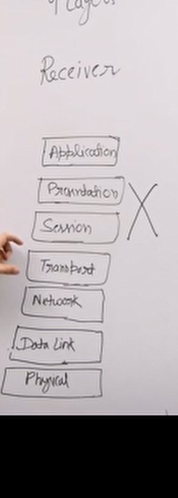
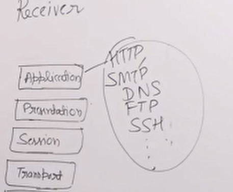

If required the application can implement its own presentation and session parts. Some realworld ex: HTTP, SMTP, DNS, FTP, SSH
# TCP/IP
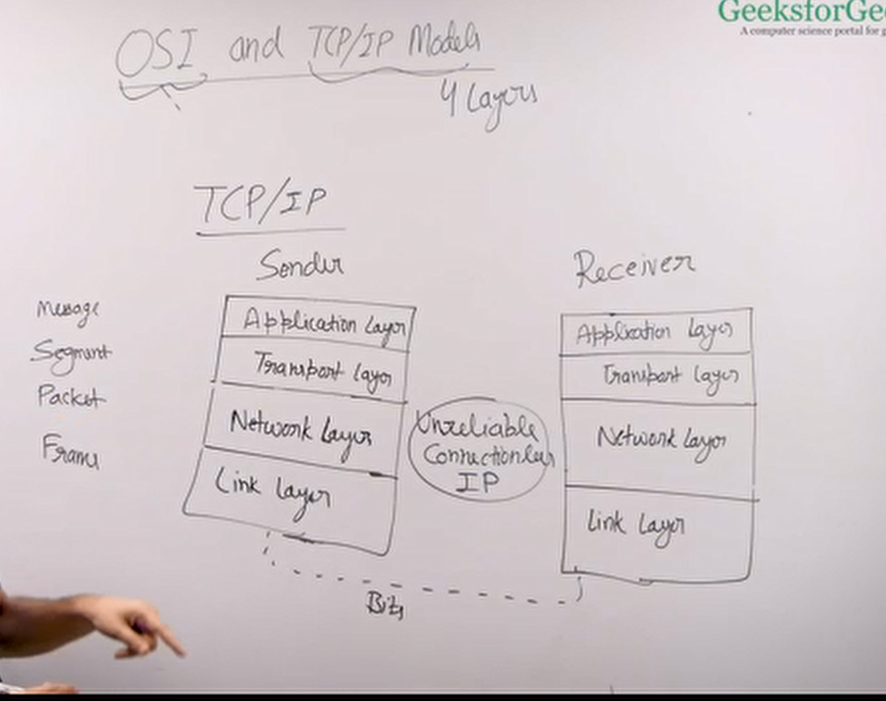

4 LAYER TCP/IP model. 
link layer does both physical layer and data link layer of the OSI model. It provides all the functionalities of the physical and the data link layer. Network layer in OSI might be reliable or unreliable, but in the TCP/IP model this is always unreliable, connectionless, and the protocol that we use her is IP. The transport layer provides end to end connection, error control, error handling. UDP and TCP. UDP is connectionless and TCP provides everything and congestion handling. examples of tcp are http and ftp. udp examples are dns and DHCP. Application layer is the same as OSI model. It is implemented by the web browser or the email client by using the services of the transport layer.  


## Protocol data unit for different layers

| type    | layer       |
|---------|-------------|
| message | application |
| segment | transport   |
| packet  | network     |
| frame   | link        |

PDUs that are used in communication.

DNS HTTP SMTP

TCP UDP

IP

ethernet copper wire wi-fi fiber optic

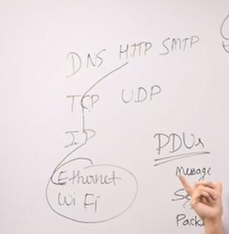

Data that is coming from the upper layer maybe divided into smaller units and then the current layer adds its own headers to the smaller individual units.


# Data link layer
Data link layer is the 4th layer from the top and 2nd layer from the bottom in the TCP/IP model. The main task of the data link layer is to take a packet from the network layer and add its own header and trailer and create a frame. The unit that the data link layer sends to the receiver is called frame. IP layer sends a packet and data link layer sends a frame.

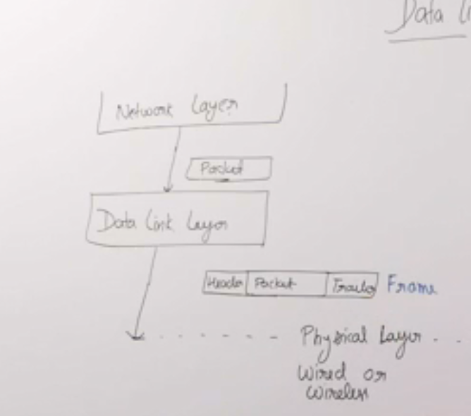

 

Then the frame is sent over the physical media (wired/wireless). The physical layer only understands 1s and 0s. In the receiver side, it parses the packet and sends it to the network layer. Real world example is a police man who makes sure person passing from one side to another does so without any issues.

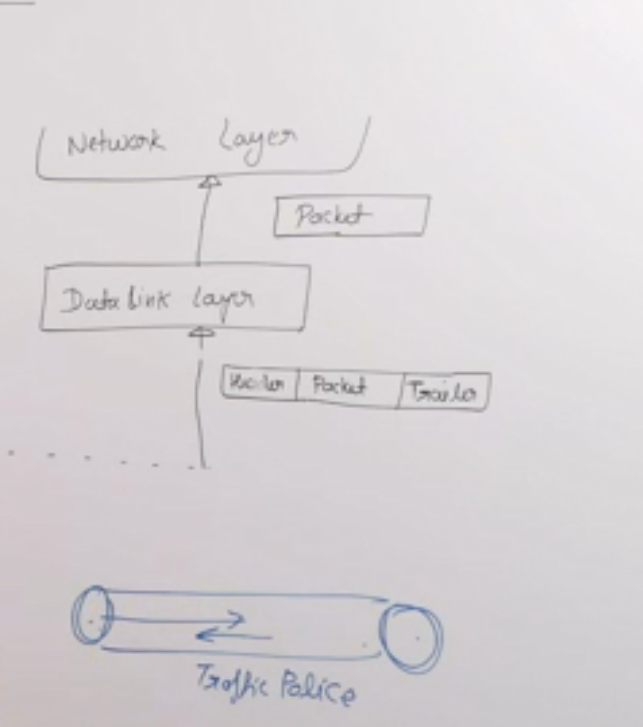

Traffic police person, does not care where they are coming and where they are going. It only cares about if the data is going through form one end to another end of the throat without any issues.

It does not care where the data is coming from or where it is going. It only cares about this communication from one end to another end must happen conveniently without any errors. 

data link layer is implemented in the network interface card, which has a 48 bit mac address. Mac address is unique. Network layer packets have an IP address. The frames have headers that has source ethernet address and destination ethernet address, which are MAC addresses (48 bit unique address). 
 ```
 # this is a docstring, which you can write codes in.
 
 ```

 unique worldwide MAC address. your network layer packets have IP addresses and these frames have source and destination ethernet addresses. 
 
we can also say that a part of data link layer is implemented in the operating system. OS provides drivers for the network interface card.

small office networks. there is a switch that connects multiple laptops. This switch is connected to the ISP router. And this ISP router usually has 2 interfaces. one interface is connected to the switch and another is connected to the internet. 
    
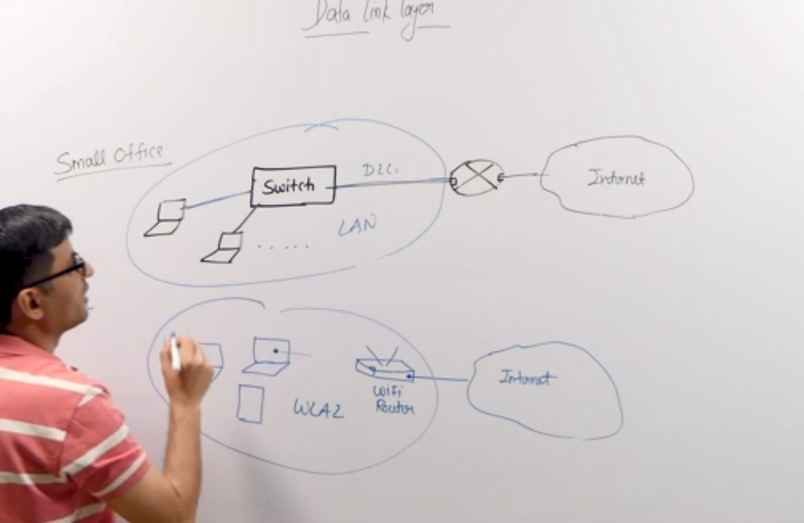

A router has 2 or more interfaces and a router creates multiple subnets. Or in other words it allows multiple networks or subnets to connect to each other.

    A tab insercts a into this box mode

Any direct one-to-one communication between any network happens through the data link layer. Any road where there is an end-to-end communication it happens through the data link layer.

Switch is a data link layer device. It has multiple ports which allows multiple device to connect to it. And one port is connected to the router which connects you to the internet. This switch allow these devices to directly connect to each other using data link layer. These devices communicate with each other using MAC addresses. This communication can happen directly through switch. 

You can have this communication without switches by using BUS where multiple devices were connected to them. There used to be collisions. The collisions were handled using CS-MA/CD and ALOHA protocol.

With switch there's no collision. It has collision domain. Switch has internal connections, which directly connects devices. It avoids collisions.

The home wi-fi still has collision chances as they use the same medium unlike switches. CS-MA/CA protocol is used to handle collisions. CA means collision avoidance.

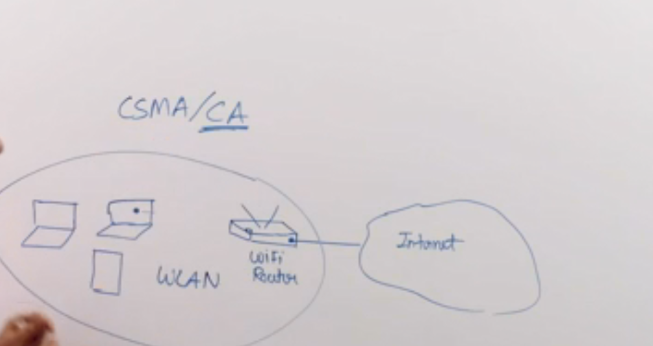

### Functionalities of Data Link Layer

Framing - we receive an IP packet, which is to be transferred through the physical media. We have to make sure the receiving end's data link layer receives this packet correctly without any issues. The physical layer may cause some issues when transferring this packet because of signal issues as it uses twisted pair, fiber optic, wi-fi, or some other media. There are possibility of errors in the physical layer. 

Framing means it takes the network layer packet it adds the destination MAC address. It has to figure out the destination MAC address by using ARP protocol. It puts the destination MAC address in the header. 

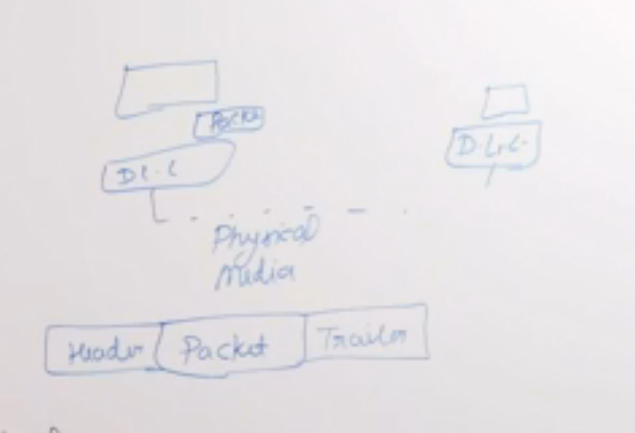

It takes this packet and uses it as payload and makes a frame. In the frame it adds a header and the header has many things like source MAC address, destination MAC address. This also adds a trailer, which includes a checksum to handle and figure out the errors. The trailer is used to check if there was any error while the frame was going through the physical medium.

The physical layer only understand binary. There might be multiple frames that has be sent across the physical media. How does receiving end figure out when has a frame ended or a new frame began. 

Two ways to know if a new frame has begun are bit stuffing and byte stuffing. 

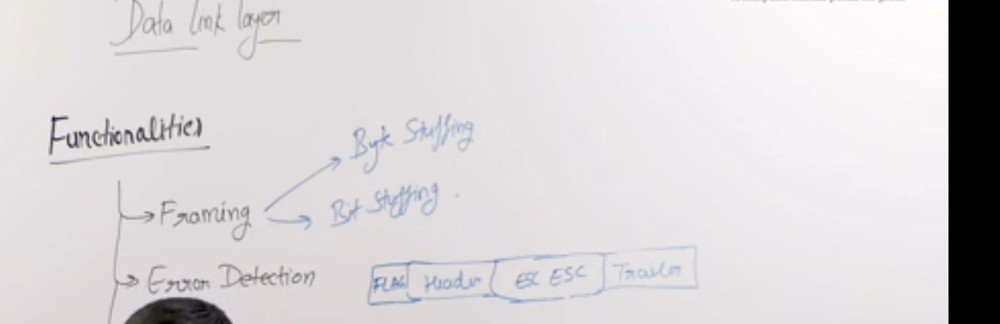

Byte stuffing - in byte stuffing we add a special flag to the beginning of the frame. When the receiver sees this flag it knows that a new frame has begun. This flag might be present in the packet. So we use an escape character to handle that.

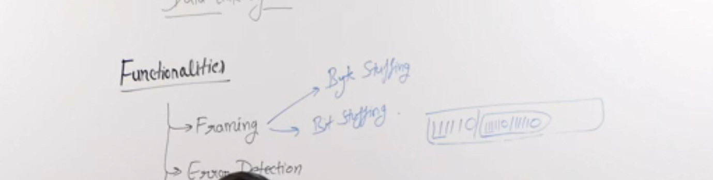

Bit stuffing - 11110 may be added in the beginning of the frame. If 111110 is present in the payload it adds 111110 again. if the receiver sees it twice it removes one copy of it and does not consider it as a beginning of a new frame.

Bit stuffing is difficult to implement in reality so the byte stuffing method is used.

### Error detection
If there was an error in the physical layer it ignores such frames that has errors. Detecting the error there are multiple methods one is called parity where we add a parity bit and another is checksum, and another one is CRC. CRC most common method for error detection.

### error and flow control
once we have detected the error we must be able to handle it. And the most common way is retransmission. Receiver simply ignores the data frame and the sender retransmits the data frame. 

How deos the sender know that there was an error and retransmits the frame. flow control is also important as the sender and the receiver may have different speeds. To solve these we have some algorithms. Stop and wait, go back n, and selective repeat. They all are variations of an algorithm named sliding window. These all together is called ARQ automatic repeat request. Repeat requests happens automatically.

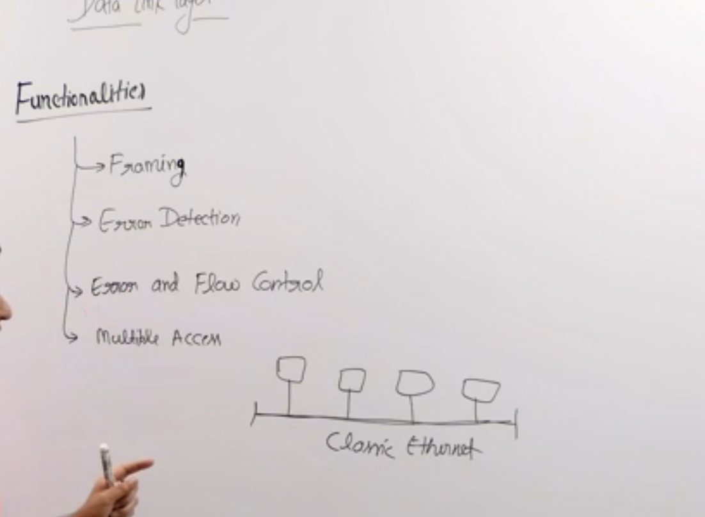

### Multiple access

The last functionality provided by data link layer is called multiple access. wi-fi - CS-MA/CA is used. 

They had a shared medium. To access the shared medium they could be using frequency division multiplexing. They have different frequency domain in which they can share the medium, but that reduces the bandwidth of every device to 1/n when there are n devices on the network. What happens in practice, the traffic of these devices come in burst. 

Another division could be time division multiplexes. Every device gets a fix allotted time to transfer the data. Most of the device is idle most of the time and one device may have to send huge amount of data.

For these issues we cannot use TDM or FDM. Algorithm used ALOHA, and CSMA/CD.

For WIFI we use CSMA/CA. 

# 4. Different Delays in Computers
## Transmission delay
The transmission delay is the time taken by the sender to put the data in the communication channel. Depends upon link bandwidth and packet length.

# Network layer
internet layer. 
prefix. contiguous ip addresses. subnet. prefix network address. make the bandwidth control
divide the big packet into smaller packets.
ip and subnetting

# 10. Circuit switching vs Packet Switching
make a connection, maintain a connection and close the connection when over. In circuit switching.
Every packet have a destination address. 

what we do in packet switching is 
there are two ways to 
one way is that every packet will have a destination address. This can go through different routers and routers have buffer inside them. If a router's buffer is full it cannot receive any more packets. so it drops packets. so if every packet has a destination address is added to it may take a different path if it sees congestion.

store and forward packet switching. 